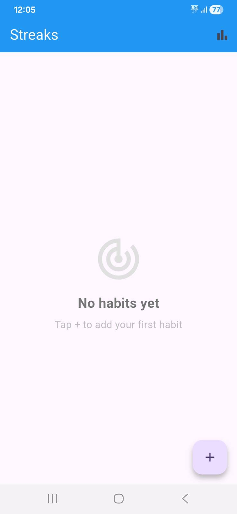
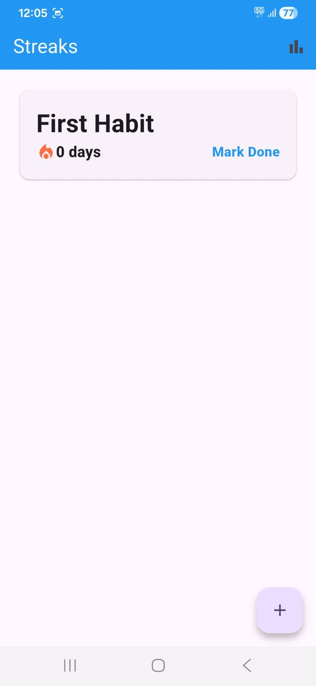
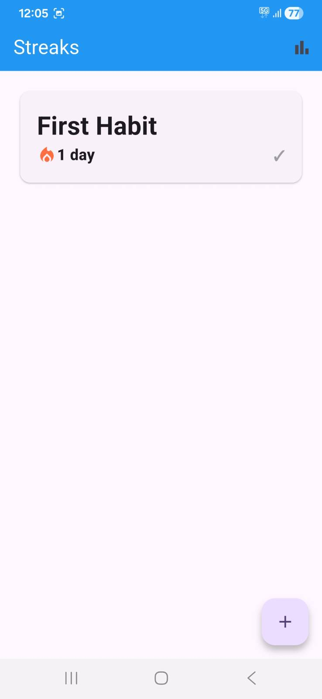
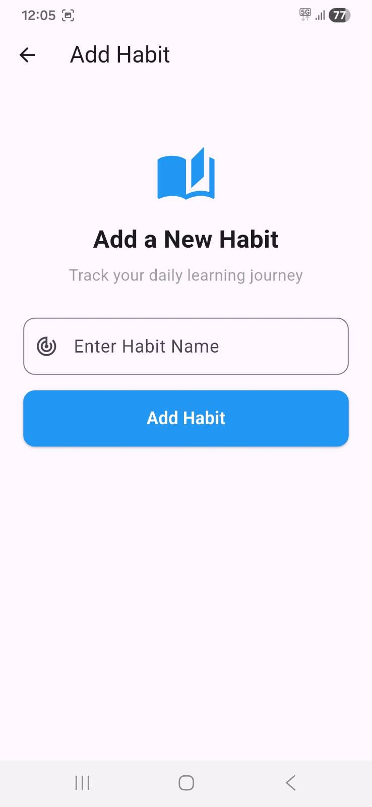
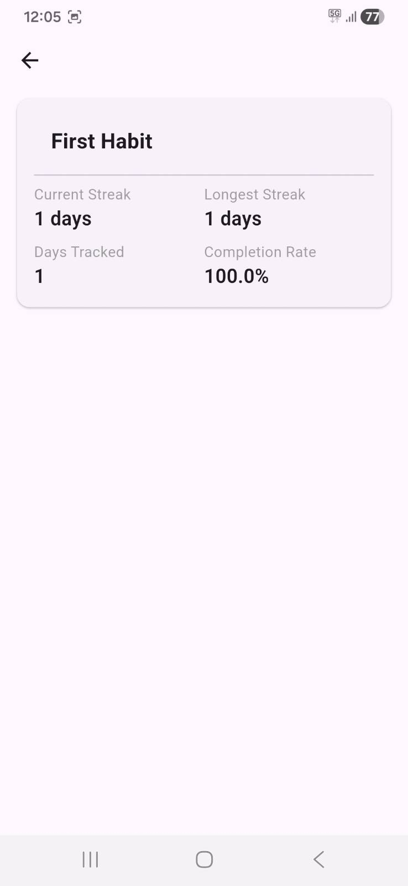
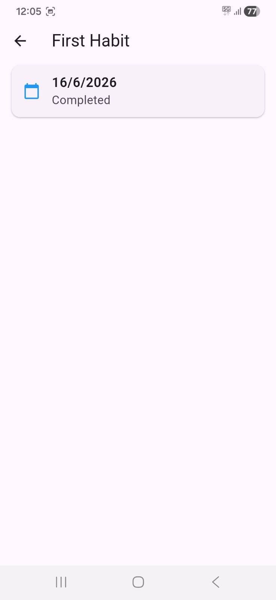

# Streaks: Daily Habit Tracker

A local-first habit tracking app built with Flutter to help you build and maintain daily learning habits.

## Features

- Add and track daily learning habits
- Mark habits as done each day
- Streak tracking: current and longest streak per habit
- Detailed statistics:  completion rate and days tracked
- Delete habits with long press
- Local persistence:  data survives app restarts
- Form validation on habit creation

## Tech Stack

- Flutter
- Bloc (state management)
- SharedPreferences (local persistence)

## Screenshots

## Architecture

Follows the BLoC pattern with clean separation between UI, business logic, and data layers. All data is stored locally using SharedPreferences with JSON serialization.
