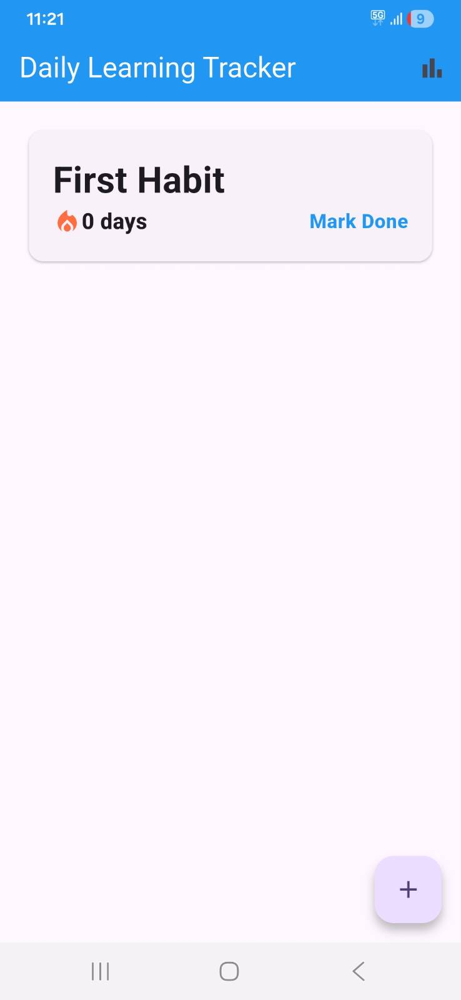
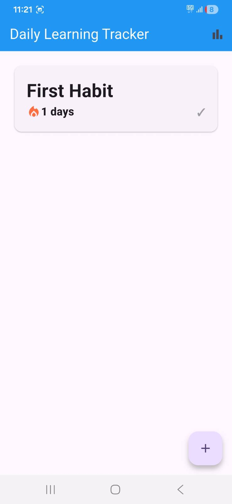
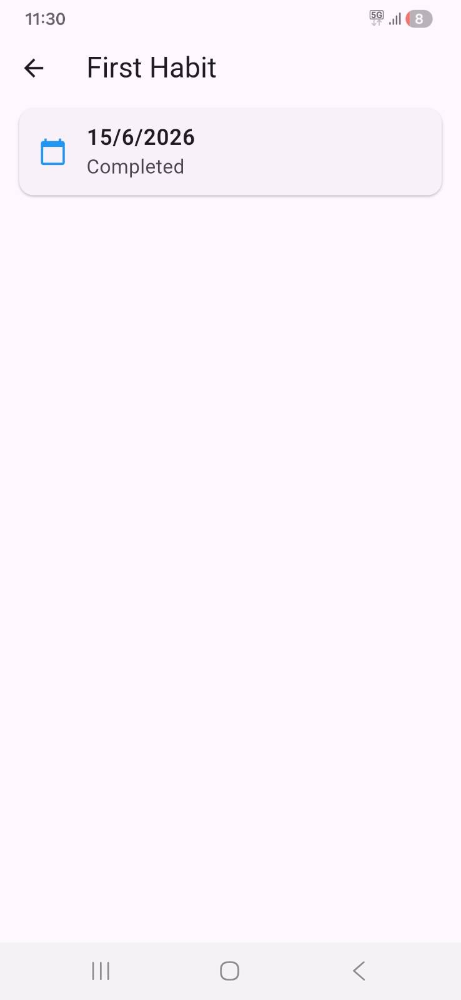
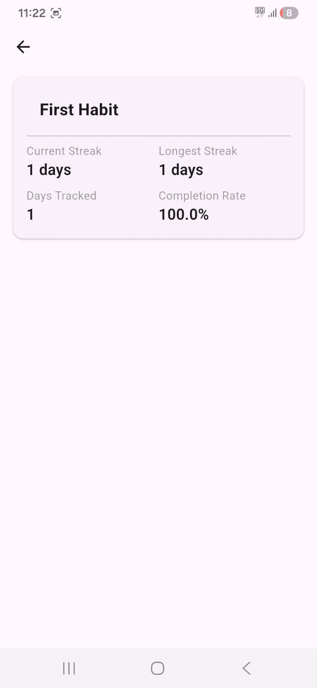

# Daily Learning Tracker

A local-first habit tracking app built with Flutter to track your daily learning journey.

## Features

- Add and track learning habits
- Mark habits as done each day
- Streak tracking with current and longest streak
- Detailed statistics per habit
- Local persistence — data survives app restarts

## Tech Stack

- Flutter
- Bloc (state management)
- SharedPreferences (local persistence)

## Screenshots

## Architecture

The app follows the BLoC pattern for state management with a clean separation between UI, business logic, and data layers.
